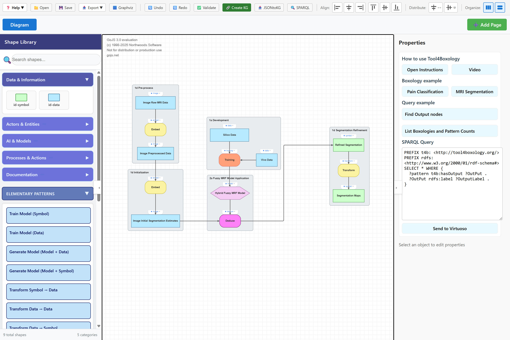
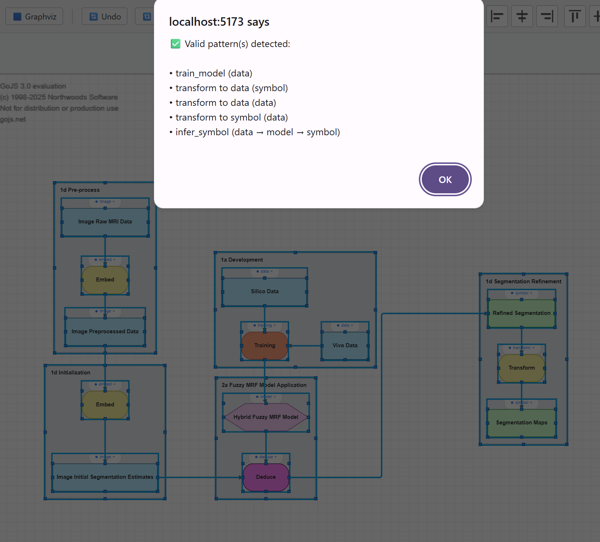

# 🧰 Tool4Boxology — Hybrid AI Design Toolkit
[](https://doi.org/10.5281/zenodo.17711495)
[](https://creativecommons.org/licenses/by/4.0/)
[](LICENSE)


**Tool4Boxology** is a toolkit for designing, validating, and exporting **hybrid AI system architectures** using the Boxology methodology.

It provides:

- A **web-based interface** (React + GoJS) for diagramming & validation  
- **Knowledge Graph (KG) generation** from diagrams  
- **Virtuoso integration** for SPARQL queries  
- A **Draw.io Docker image** with preloaded Boxology plugin & libraries  


Inspired by:  
**Frank van Harmelen et al., "Modular Design Patterns for Hybrid Learning and Reasoning Systems" (Web Semantics, 2023).**

---

## 📌 Recommended Entry Point

> **Start with the `Boxology-Interface` web app.**  
> It's the main way to design, validate, and export Boxology diagrams and knowledge graphs.

- Visual editor (React + GoJS)  
- Real-time validation of Boxology patterns  
- Active KG generation + Virtuoso integration  
- Multiple export formats (JSON, Styled JSON, DOT, PNG, RDF/Turtle)

The `Boxology-Docker` submodule (Draw.io image) is **optional** and provides a Draw.io instance with the Boxology plugin and libraries already installed—useful if you prefer Draw.io or want a lightweight environment for pattern design.

---

## 📂 Repository Structure

| Folder / Module         | Description |
|-------------------------|-------------|
| **Boxology-Interface**  | Web-based visual editor (React + TypeScript + GoJS) with validation, KG generation, and Virtuoso integration. |
| **Boxology-Docker**     | Custom Draw.io Docker image with pre-installed Boxology plugin, libraries, and sidebar images. |
| **Boxology-plugin**     | Standalone Draw.io plugin and Boxology shape libraries for manual use in Draw.io. |
| **kg_creation**         | Knowledge graph creation logic, RML mappings, RDFizer/SDM-RDFizer integration, and SPARQL utils. |
| **ElementaryPattern**   | Elementary patterns in DOT format for modular visualization and reuse. |
| **Report**              | Project documentation, notes, and development history. |

---

# 🚀 Getting Started

There are **two main ways** to use Tool4Boxology:

1. **Boxology-Interface (recommended)** – full web editor + KG pipeline  
2. **Boxology-Docker (Draw.io)** – Draw.io with Boxology plugin preloaded

---

# 1️⃣ Using the Boxology-Interface (Recommended)

This interface is the core visual editor. It supports:

- 📦 Drag-and-drop components  
- 🔗 Semantic connectors  
- 🎯 Clustering  
- 🆔 Stable IDs  
- 🧠 KG generation  
- 🔍 Virtuoso integration  
- 💾 JSON, Styled JSON, RDF, DOT, PNG export  
- 🧩 Real-time validation  

---

## ✨ Interface Features

### Diagram & Modeling
- Drag-and-drop Boxology components  
- Semantically meaningful edges  
- Containers & clustering  
- Visual customization  

### Knowledge Graph Features
- Real-time KG generation  
- Stable component IDs  
- Two JSON export types  
- RDF/Turtle export  

### Virtuoso Integration
- Auto-upload RDF  
- One-click SPARQL navigation  
- KG browsing  

---

## 🧰 Built With

- React  
- TypeScript  
- Vite  
- GoJS  
- Material-UI  
- FastAPI  
- Virtuoso  
- Graphviz  
- RDFLib  

---

# 💻 How to Start the Interface

### 🔧 Prerequisites

- Node.js ≥ 16  
- Python ≥ 3.8  
- Docker + Docker Compose (for full pipeline)

---

## 🚀 **Option A — Docker Compose (Full Pipeline, Recommended)**

From Boxology-Interface root:

```bash
docker-compose up -d
```

Open: http://localhost:5173

---

## 🚀 **Option B — Manual Startup**

### 1. Virtuoso
```bash
docker run -d --name virtuoso -p 8890:8890 -p 1111:1111 -e DBA_PASSWORD=dba -e SPARQL_UPDATE=true -v virtuoso_data:/opt/virtuoso-opensource/database openlink/virtuoso-opensource-7:latest

```

### 2. Backend
```bash
cd Boxology-Interface
cd backend
uvicorn main:app --reload --host 0.0.0.0 --port 8000
```

### 3. Frontend
```bash
cd Boxology-Interface
npm install
npm run dev
```

Open: http://localhost:5173

### 3. Use the Interface
Open the GoJS-based visual editor from the Boxology-interface folder. Instructions are included in its README.

---

## 📂 Boxology-Interface – Folder Structure

```
Boxology-Interface
├── src/
│   ├── components/
│   ├── utils/
│   ├── pages/
│   ├── hooks/
│   ├── styles/
│   └── main.tsx
├── backend/
│   └── kg_generator/
├── public/
├── vite.config.ts
└── tsconfig.json
```

---

## 🎯 Interface Workflow Example

1. Build architecture  
2. Cluster components  
3. Validate  
4. Generate KG  
5. Export JSON/RDF  
6. Upload to Virtuoso  
7. Run SPARQL queries  
8. Export DOT/PNG  

---

## 📘 Example

> _A sample hybrid AI pipeline using Tool4Boxology._



> ✅ Check for validation!




---

# 2️⃣ Using the Boxology-Docker (Draw.io with Plugin)

The Boxology-Docker module provides a Draw.io image extended from `fjudith/drawio` with:

- Pre-installed Boxology plugin  
- Pre-loaded Boxology shape libraries  
- Sidebar images  
- No manual upload required  

---

## 📦 Boxology-Docker – Getting Started

### 1. Build + Run
```bash
cd Tool4Boxology/Boxology-Docker

docker build -t boxology-drawio .
docker run -p 8080:8080 boxology-drawio
```

Open:  
👉 http://localhost:8080

### 2. docker-compose (If available)
```bash
docker-compose up
```

---

## 🧩 What's Inside the Docker Image?

- BoxologyValidation.js plugin  
- PatternLib.xml  
- ShapeLib.xml  
- AnnotationLib.xml  
- Sidebar preview icons  
- Custom entrypoint script  

---

## 🔍 Boxology-Docker – File Structure

| Path | Description |
|------|-------------|
| Dockerfile | Builds Boxology-enabled Draw.io |
| docker-entrypoint.sh | Configures and runs Tomcat/Draw.io |
| js/plugins/ | Plugin logic |
| lib/ | XML libraries |
| images/ | Sidebar icons |


---

# 📚 References

- Harmelen et al., Web Semantics 2023   

---

# 📜 License
-CC BY 4.0 — diagrams, documentation, educational assets

-Apache 2.0 — included third-party or extended modules


---
## 📖 Related Source Paper & Authors

Tool4Boxology is based on the research and methodology described in the source paper (submitted):

**Tool4Boxology:  
A Semantic Toolbox for Constructing and Analyzing Neuro-Symbolic Architectures**

**Authors:**  
Johannes E. Bendler<sup>1</sup>, Yashrajsinh Chudasama<sup>2,3</sup>, Mahsa Forghani<sup>2,3</sup>, Enrique Iglesias<sup>2,4</sup>, Disha Purohit<sup>2,3</sup>, Jacquiline Roney<sup>1</sup>, Annette ten Teije<sup>1</sup>, Frank van Harmelen<sup>1</sup>, Maria-Esther Vidal<sup>2,3</sup>

<sup>1</sup> Department of Computer Science, Vrije Universiteit Amsterdam, The Netherlands  
<sup>2</sup> TIB-Leibniz Information Centre for Science and Technology, Hannover, Germany  
<sup>3</sup> Leibniz University Hannover, Hannover, Germany  
<sup>4</sup> L3S Research Center Germany, Hannover, Germany  

**Supervision:**  
This work is supervised by the above authors and institutions.

**Corresponding author:**  
📧 mahsa.forghani.tehrani@stud.uni-hannover.de
Leibniz University Hannover 

